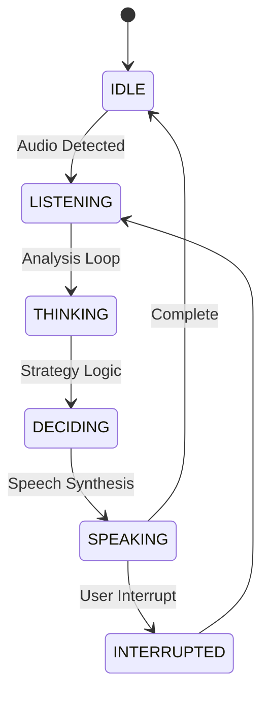

# AI Interview Assistant: Production-Level Intelligent Agent

This is a specialized, purpose-driven AI agent designed for high-stakes interview preparation. Unlike basic voice assistants that follow a linear "Input -> Process -> Output" pipeline, this agent implements an autonomous **THINK → DECIDE → ACT** loop for truly intelligent behavior.

## 🎯 Problem Statement
Most voice AI tutorials show a simple linear flow: **Record → Transcribe → LLM → Speak**. This creates a fragile, "dumb" system that responds to noise, fails on silence, and lacks conversational nuance.

**This agent solves that by acting as a system-aware interviewer.** It evaluates input quality before processing, decides on the best conversational strategy, and supports real-time interruptions.

---

## 🧠 System Architecture (THINK → DECIDE → ACT)

The agent operates on a sophisticated state-machine that prioritizes intelligence over sequential execution:

1. **THINK (Analysis Phase)**:
   - Analyzes audio energy and transcription quality.
   - Detects intent: Is the user answering a question, asking for help, or is it just background noise?
2. **DECIDE (Strategy Phase)**:
   - Chooses a response strategy: Should I ask a deep follow-up? Should I clarify? Should I ignore this noise?
   - Applies speech constraints (brevity, tone, natural flow).
3. **ACT (Execution Phase)**:
   - Generates the context-aware response.
   - Synthesizes speech and manages the audio thread.
   - Monitors for **User Interruptions** during speech to allow natural "cut-ins".

---

## 🚀 Key Production Features

- **Intelligence Loop**: Explicit `think()` and `decide()` methods for system-level logic.
- **Interrupt Handling**: High-priority feature that stops AI speech immediately when the user speaks.
- **Smart Memory**: 8-turn sliding window memory with JSON-structured context.
- **Production UX**: Real-time console status (`Listening...`, `Thinking...`) and robust error recovery.
- **Offline First**: Local Whisper (STT) and Piper (TTS) for maximum privacy and low latency.
- **Role Consistency**: Strictly adheres to the "Professional AI Interviewer" persona via advanced system prompting.

---

## ⚙️ Setup & Usage

1. **Environment**: Install `pip install -r requirements.txt`.
2. **Keys**: Add `OPENAI_API_KEY` to the `.env` file.
3. **Run**: `python run.py`.

---
*Built for realistic, high-performance interview practice.*
