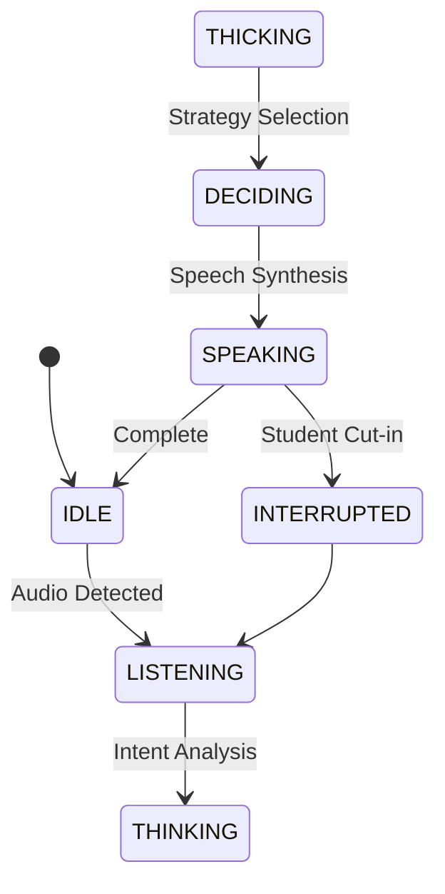

# AI Study Assistant: Intelligent Voice Agent

A specialized, purpose-driven AI agent designed to help students master academic concepts through natural voice interaction. Unlike basic voice pipelines, this agent uses a **THINK → DECIDE → ACT** loop to provide an intelligent tutoring experience in **English, Hindi, and Bengali**.

## 🎯 Problem Statement
Students often need quick, clear explanations of complex topics without wading through long articles. This agent acts as a patient academic tutor that provides concise, speech-optimized explanations and supports multilingual learners.

## 🧠 Agent Architecture (THINK → DECIDE → ACT)

This agent moves beyond simple "record and respond" logic by implementing an autonomous decision loop:

1. **THINK (Analysis)**: The agent analyzes transcribed text to detect academic intent, language, and input quality.
2. **DECIDE (Strategy)**: It chooses between explaining a concept, asking for clarification on broad topics, or ignoring background noise.
3. **ACT (Execution)**: It generates a brief, 2-3 sentence response in the user's language, synthesizes audio, and updates the 8-message context window.



## 🚀 Key Features

- **Multilingual Support**: Fluently chat and learn in **English, Hindi, and Bengali**.
- **Interrupt Handling**: The agent stops speaking immediately if the student has a follow-up question.
- **Intelligent VAD**: Energy-based detection filters out noise and precisely captures academic queries.
- **Smart Memory**: Maintains a focused 8-message context to keep the study session relevant.
- **Speech Optimized**: Strictly limited to 2-3 sentences per turn for natural, non-fatiguing voice interaction.

## 🛠️ Project Structure

```text
├── app/
│   ├── agents/          # VoiceAgent (T-D-A Intelligence)
│   ├── audio/           # Recorder & Player (Interrupt-ready)
│   ├── config/          # Settings & States
│   ├── llm/             # Academic Prompts & LLM Client
│   ├── memory/          # 8-Message Context Window
│   ├── stt/             # Multilingual Whisper STT
│   └── tts/             # Piper TTS
├── data/                # Study Session Audio
├── models/              # Local Model Weights
├── run.py               # Application Entry Point
```

## ⚙️ Setup & Execution

1. **Install Dependencies**: `pip install -r requirements.txt`
2. **Configure Environment**: Add `OPENAI_API_KEY` to your `.env` file.
3. **Start Learning**: `python run.py`

---
*Empowering learners through intelligent voice technology.*
