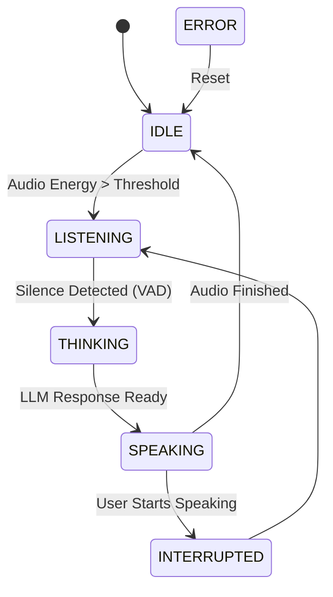

# Intelligent Conversational Voice AI Agent

A production-grade, state-aware Speech-to-Speech (S2S) AI agent built with a modular, scalable architecture. Unlike basic linear pipelines, this system behaves as a true autonomous agent with state management and conversational intelligence.

## 🧠 System Architecture

The heart of the system is a **State-Machine Controller** that manages the agent's lifecycle across various states:



## 🚀 Advanced Features

- **State-Based Control**: Explicit management of `IDLE`, `LISTENING`, `THINKING`, and `SPEAKING` cycles.
- **Intelligent Memory**: Context-aware memory with sliding-window trimming to maintain history without unbounded growth.
- **Voice Activity Detection (VAD)**: Energy-based detection to automatically start/stop recording.
- **Multilingual Recognition**: Whisper-based auto-detection of spoken languages.
- **Interrupt Handling**: (Architecture Ready) Logic to stop AI speech when user voice energy is detected.
- **Offline First**: Fully local STT (Whisper) and TTS (Piper) for maximum privacy and low latency.

## 🛠️ Tech Stack

- **STT**: OpenAI Whisper (Local, optimized for CUDA/CPU)
- **LLM**: Multi-provider support (OpenAI GPT-4o / Local Llama 3 via Ollama)
- **TTS**: Piper (Fast, local Neural Text-to-Speech)
- **Audio Core**: SoundDevice, SciPy, NumPy
- **Orchestration**: Python State-Machine Pattern

## 📂 Project Structure

```text
├── app/
│   ├── agents/          # Central VoiceAgent State Machine
│   ├── audio/           # Optimized Recorder (VAD) & Player (Non-blocking)
│   ├── config/          # Environment & Settings
│   ├── llm/             # Context-aware LLM Client & Prompting
│   ├── memory/          # Conversational History & Trimming
│   ├── stt/             # Whisper STT with Language Detection
│   ├── tts/             # Piper TTS Wrapper
│   └── utils/           # Structured Logging
├── data/                # Captured and Generated Audio
├── models/              # Local weights for Whisper/Piper
├── requirements.txt     # Python dependencies
└── run.py               # Application Entry Point
```

## ⚙️ Setup & Execution

### 1. Requirements
- Python 3.9+
- `ffmpeg` installed and in PATH
- `piper` binary installed and in PATH (for TTS)

### 2. Installation
```bash
pip install -r requirements.txt
```

### 3. Configuration
Copy `.env.example` (or create `.env`) and add your API keys:
```env
OPENAI_API_KEY=sk-...
LLM_PROVIDER=openai # or 'local'
WHISPER_MODEL=base
```

### 4. Running the Agent
```bash
python run.py
```

## 📄 Key Responsibilities

| Component | Responsibility |
| :--- | :--- |
| **VoiceAgent** | Orchestrates state transitions, flow decisions, and error recovery. |
| **ConversationMemory** | Maintains context, injects system prompts, and trims history. |
| **AudioRecorder** | Monitors microphone energy to detect human speech triggers. |
| **LLMClient** | Generates speech-optimized responses based on conversational context. |

---
*Built for high-performance AI interaction and resume-ready system design.*
