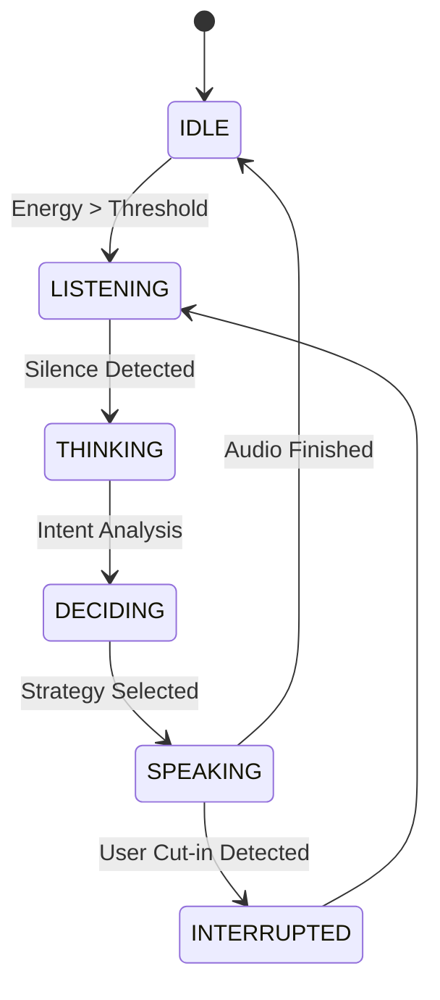

# AI Interview Assistant: Intelligent Voice Agent

A specialized, purpose-driven AI agent designed to help professionals practice job interviews through natural voice interaction. Unlike basic voice pipelines, this agent uses a **THINK → DECIDE → ACT** loop to provide a realistic and intelligent mock interview experience.

## 🎯 Problem Statement
Preparing for interviews often lacks real-time, bidirectional vocal practice. This agent solves that by acting as a professional interviewer that asks behavioral questions, evaluates responses, and provides immediate feedback.

## 🧠 Agent Architecture (THINK → DECIDE → ACT)

This agent moves beyond simple "record and respond" logic by implementing an intelligent decision loop:

1. **THINK**: The agent analyzes transcription for intent, noise, or short inputs (VAD + Heuristics).
2. **DECIDE**: It chooses a strategy—clarification, deep follow-up, or professional feedback—based on the current interview stage.
3. **ACT**: It generates a speech-optimized response, synthesizes audio, and updates conversational memory.



## 🚀 Advanced Features

- **Interrupt Handling**: The agent immediately stops speaking if it detects the user trying to speak, allowing for natural conversation flow.
- **Intelligent VAD**: Energy-based detection filters out background noise and precisely captures speech.
- **Context-Aware Memory**: Maintains a professional interview context and can provide a summary of the session.
- **Multilingual Support**: Automatically detects the user's spoken language via Whisper.
- **Offline First**: All speech-to-text (Whisper) and text-to-speech (Piper) processing is done locally.

## 🛠️ Project Structure

```text
├── app/
│   ├── agents/          # VoiceAgent (Intelligence Loop)
│   ├── audio/           # Recorder (Interrupt-ready) & Player
│   ├── config/          # Settings & States
│   ├── llm/             # Interview Prompts & LLM Logic
│   ├── memory/          # Interview Session Context
│   ├── stt/             # Whisper STT
│   └── tts/             # Piper TTS
├── data/                # Session Audio Data
├── models/              # Local Model Weights
├── run.py               # Application Entry Point
```

## ⚙️ Setup & Execution

1. **Install Dependencies**: `pip install -r requirements.txt`
2. **Configure Environment**: Add `OPENAI_API_KEY` to your `.env` file.
3. **Launch Interviewer**: `python run.py`

---
*Built for realistic, high-stakes interview preparation.*
