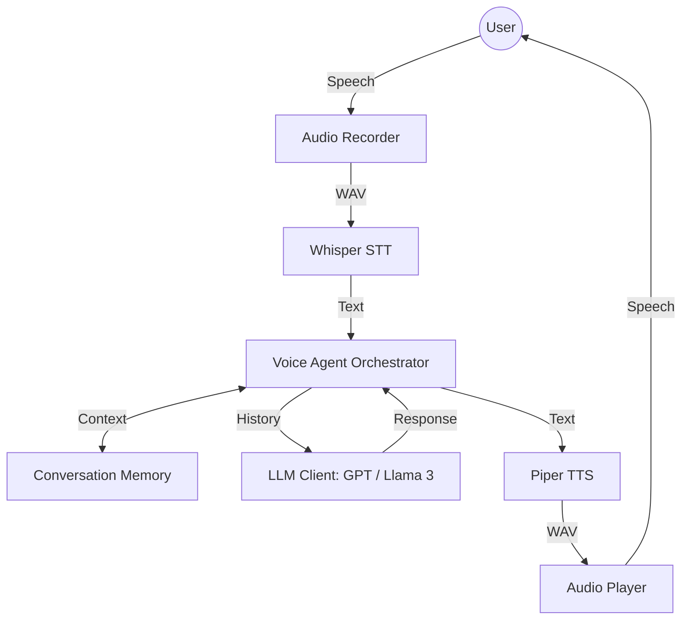

# Production-Level Modular AI Voice Agent

A high-performance, scalable, and modular Speech-to-Speech (S2S) conversational AI agent built in Python. Designed with industry best practices for AI system design.

## 🧱 Architecture Diagram



## 🚀 Key Features

- **Modular Design**: Clean separation of concerns (Audio, STT, LLM, TTS, Memory).
- **Dual LLM Support**: Switch between OpenAI GPT and Local Llama 3 via config.
- **Local STT & TTS**: Uses OpenAI Whisper and Piper TTS for offline-first capabilities.
- **Smart Memory**: Conversational history with sliding window trimming.
- **Structured Logging**: Comprehensive tracing of the agent's internal state.
- **Production-Ready**: Scalable architecture designed for easy extension.

## 🛠️ Tech Stack

- **Speech-To-Text**: OpenAI Whisper (Local)
- **Intelligence**: OpenAI GPT-4o / Meta Llama 3 (via local API)
- **Text-To-Speech**: Piper TTS (Local Neural TTS)
- **Audio I/O**: SoundDevice, Scipy, NumPy
- **Orchestration**: Python (Modular Class-based Design)

## 📦 Project Structure

```text
voice-ai-agent/
├── app/
│   ├── main.py             # Application entry point
│   ├── config/             # Environment & settings
│   ├── audio/              # Microphone & Speaker handlers
│   ├── stt/                # Speech-to-Text logic
│   ├── llm/                # Brain & Prompt Management
│   ├── tts/                # Text-to-Speech generation
│   ├── memory/             # Historical context management
│   ├── agents/             # The central Brain (Orchestrator)
│   └── utils/              # Logging & Helpers
├── data/                   # Storage for temporary audio files
├── models/                 # Local model weights (Whisper/Piper)
├── requirements.txt        # Python dependencies
└── run.py                  # CLI runner
```

## ⚙️ Setup Instructions

1. **Install System Dependencies** (Windows/Linux):
   - Ensure `ffmpeg` and `piper` are installed and in your PATH.
   - For audio: `pip install pyaudio` (may require VC++ build tools on Windows).

2. **Setup Python Environment**:
   ```bash
   pip install -r requirements.txt
   ```

3. **Configure Environment Variables**:
   Edit the `.env` file and add your `OPENAI_API_KEY`.

4. **Prepare Local Models**:
   Download Piper ONNX models into the `models/` directory.

## 🏃 How to Run

```bash
python run.py
```

## 🔮 Future Improvements

- [ ] Web-based Dashboard for real-time monitoring.
- [ ] Adaptive Bitrate streaming for slower connections.
- [ ] Multi-user session management via Redis.
- [ ] Integration with vector databases for RAG-based domain knowledge.

---
Built with 💜 for Advanced AI Agent Development.
